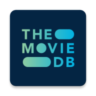
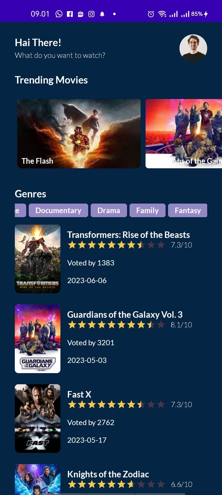
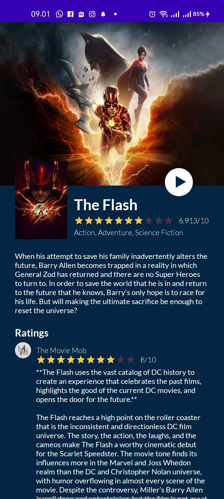
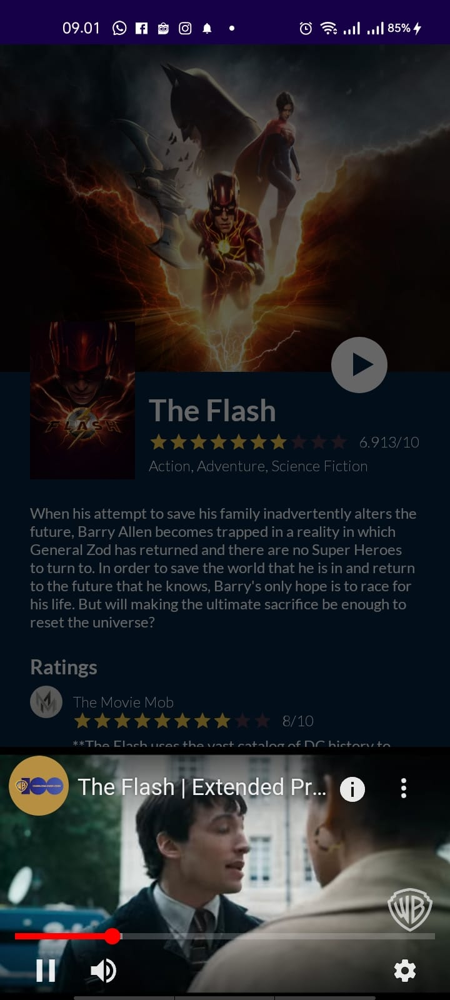

 

  

  <h3 align="center">TheMovieDB-Android</h3>

  

     
    <a href="https://raw.githubusercontent.com/codernewbie04/TheMovieDB-Android/development/assets/app-debug.apk">View Demo</a>
  

## Mock-Up
[Figma](https://www.figma.com/file/Ud8lpVwAzNoD4pUYoLAJuY/TheMovieDB-Android?type=design&node-id=0%3A1&mode=design&t=Cbn3BCoqN2zPCPe4-1)

## REST API Documentation
[TMDB](https://developer.themoviedb.org/docs)

## Preview

  
  
  

### Key Features
* Movie List
* Movie List By Genre
* Detail of Movie
* Trailer movie
## Technology
* Kotlin
* Dagger-Hilt
* Retrofit2
* Coil

